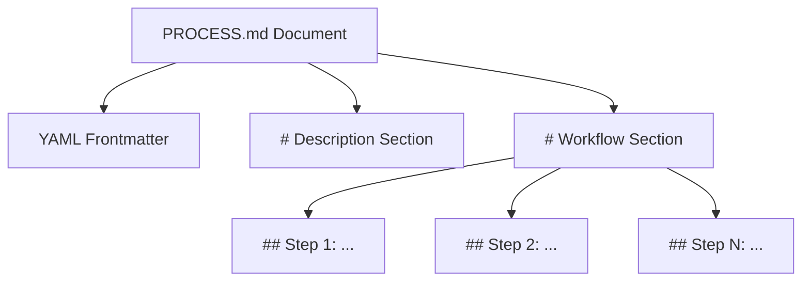

# PROCESS.md Specification v0.1.0

## Status of this Document
This document defines the **v0.1.0** release of the `PROCESS.md` standard. The standard is an open specification for defining executable Standard Operating Procedures (SOPs) for artificial intelligence agents and workflow engines.

---

## 1. Introduction & Design Philosophy

As AI agents move from simple chatbots to operational teammates, organizations need a way to orchestrate multi-step business logic without locking the workflow inside opaque prompt templates, hardcoded python code, or brittle visual drag-and-drop state machines.

`PROCESS.md` is a prose-first, Markdown-based file format that allows operational owners (operations, finance, marketing, legal) to define workflows that are directly executable by AI runtimes. It bridges the gap between human readability and machine execution.

### 1.1 Core Tenets
* **Prose-First Ownership:** Process owners write and maintain procedures in clean, standard Markdown. The workflow remains human-readable, auditable, and version-controlled.
* **Separation of Concerns:**
  * **Skills (`SKILL.md`):** Reusable, context-independent capabilities (e.g., "Analyze Web Traffic"). They define *how* to perform a specific action.
  * **Processes (`PROCESS.md`):** Context-dependent, step-by-step orchestrations (e.g., "Weekly Marketing Readiness Review"). They define *what* to do and *when*.
* **Bounded Reasoning & Isolation:** Run-times execute workflows one step at a time. The agent cannot jump steps, execute side effects of step 3 while in step 1, or execute external actions without satisfying safety conditions.
* **Security at the Runtime Gate:** Natural language text inside a markdown file cannot be trusted to enforce authorization or safety boundaries. Security policies (such as dry-runs or write approvals) are defined in configuration files (`pdt.yaml`) and enforced strictly by the compiler and execution runtime.

---

## 2. Document Layout

Every conforming `PROCESS.md` document must consist of three distinct blocks in the following order:



### 2.1 YAML Frontmatter
The file must begin with a YAML frontmatter block enclosed by triple-dashes `---`.

#### Required Fields
* **`id`** *(string)*: Unique, stable, lowercase `snake_case` identifier for the process. Must match regex `^[a-z0-9_]+$`.
* **`name`** *(string)*: A human-readable title of the process.
* **`version`** *(string)*: Semantic version of the process (e.g., `1.0.0`).
* **`owner`** *(string)*: The group or department responsible for maintaining and authorizing execution of the process (e.g., `growth-ops`, `finance`).

#### Optional Fields
* **`status`** *(string)*: Lifecycle stage of the process. Allowed values: `draft`, `active`, `deprecated`. Default is `draft`.
* **`description`** *(string)*: A one-sentence summary of the process, used for cataloging.
* **`tags`** *(list of strings)*: Categories or labels for organization (e.g., `[marketing, experiment, automation]`).
* **`runtime`** *(string)*: Specifies the engine version or execution style required. Default: `pdt.process.v0`.

#### Example Frontmatter
```yaml
---
id: growth_experiment_review
name: Growth Experiment Review and Analysis
version: 0.1.0
owner: growth-ops
status: active
description: Analyzes completed product growth experiments and updates downstream spreadsheets.
tags: [growth, analytics, operations]
runtime: pdt.process.v0
---
```

### 2.2 The `# Description` Section
Immediately following the frontmatter, the document must contain a level-1 heading titled `# Description`.

```markdown
# Description
Detailed operational guidelines, scope boundaries, prerequisites, and business goals.
```

#### Behavioral Rules
1. **Global Context Injection:** The runtime engine **must** inject the entire content of the `# Description` section into the LLM context window for every single step of the workflow.
2. **Sub-sections:** Sub-headings (e.g., `## Scope`, `## Expected Outcomes`, `## Pre-conditions`) are permitted and encouraged to keep documentation organized.

### 2.3 The `# Workflow` Section
The workflow contains a level-1 heading titled `# Workflow`. Inside this section, individual steps are represented by level-2 headings using the syntax:

```markdown
## Step <N>: <Step Name>
```

Where `<N>` is a sequential integer starting at `1`, and `<Step Name>` is a descriptive title.

#### Step Execution Semantics
* **State Isolation:** The runtime compiles and processes each step separately.
* **Text instructions:** Markdown text beneath each step heading defines the natural language instruction set for that specific step.
* **Reference Invocation:** Steps may reference tools, skills, schemas, or other sub-processes. The compiler resolves these references to equip the executing agent with the correct tools or capabilities for that step.

---

## 3. Reference Resolution Schema

To bind natural language instructions to executable components or validation schemas, `PROCESS.md` uses inline code references formatted as `` `type/id` ``.

The compiler resolves these references dynamically at compile-time or runtime based on the workspace path configuration defined in `pdt.yaml`.

| Reference Syntax | Description | Resolution Target |
| :--- | :--- | :--- |
| `` `skill/<id>` `` | Reusable, instructional capabilities written in Markdown. | Resolves to `skills/<id>/SKILL.md` |
| `` `tool/<id>` `` | Executable software tools defined by YAML manifest files. | Resolves to `tools/<id>/tool.yaml` |
| `` `schema/<id>` `` | JSON Schema files defining data payload contracts. | Resolves to `schemas/<id>.schema.json` |
| `` `process/<id>` `` | Another process definition invoked as a sub-workflow. | Resolves to `processes/<id>/PROCESS.md` |

### 3.1 Reference Resolution Algorithm
When the runtime parses a step, it scans for `` `type/id` `` patterns:
1. **Identify the reference class (`type`):** One of `skill`, `tool`, `schema`, or `process`.
2. **Lookup path directory:** Locate the base directory for the reference class as specified in the `pdt.yaml` config (e.g., `./skills`, `./tools`).
3. **Locate target file:**
   * If type is `skill`, verify file `skills/<id>/SKILL.md` exists.
   * If type is `tool`, verify file `tools/<id>/tool.yaml` exists.
   * If type is `schema`, verify file `schemas/<id>.schema.json` exists.
   * If type is `process`, verify file `processes/<id>/PROCESS.md` exists.
4. **Context Injection & Tool Mapping:**
   * **Skills:** The text contents of `SKILL.md` are appended to the agent's instructions for that step.
   * **Tools:** The tool is instantiated and made available to the agent for execution during that step.
   * **Schemas:** The schema constraint is loaded. If the step specifies output generation, the runtime validates the output payload against this schema before completing the step.
   * **Processes:** The runtime halts the current sequence, instantiates the child process, executes it, and returns the result to the parent execution context.

---

## 4. Configuration Schema (`pdt.yaml`)

Each workspace or workspace subset must include a `pdt.yaml` file at its root. This file establishes the environment, permissions, and paths for all resources referenced within the workspace's processes.

### 4.1 Specification of `pdt.yaml` Fields

* **`project`** *(object, required)*:
  * `id` *(string)*: Unique slug for the project.
  * `name` *(string)*: Human-readable project name.
* **`paths`** *(object, optional)*: Directories containing standard resources. Relative paths are resolved relative to the directory containing `pdt.yaml`.
  * `processes` *(string)*: Directory for processes. Default: `./processes`
  * `skills` *(string)*: Directory for skills. Default: `./skills`
  * `tools` *(string)*: Directory for tools. Default: `./tools`
  * `schemas` *(string)*: Directory for JSON schemas. Default: `./schemas`
* **`tools`** *(object, optional)*:
  * `allow` *(list of strings)*: Explicit list of tool IDs that the agent is allowed to execute. If a process attempts to load a tool not on this list, compilation must fail.
* **`policy`** *(object, optional)*:
  * `dry_run_blocks_side_effects` *(boolean)*: If true, tools flagged with `side_effects: true` in their `tool.yaml` will be bypassed or mock-executed when running in dry-run mode. Default: `true`.
  * `require_approval_for_external_writes` *(boolean)*: If true, execution pauses and requests human validation before executing any write operations (like database updates or API post requests). Default: `true`.

### 4.2 Example `pdt.yaml`
```yaml
project:
  id: company_ops
  name: Company Operations Workflows

paths:
  processes: ./processes
  skills: ./skills
  tools: ./tools
  schemas: ./schemas

tools:
  allow:
    - experiment_lookup
    - campaign_asset_lookup

policy:
  dry_run_blocks_side_effects: true
  require_approval_for_external_writes: true
```

---

## 5. Runtime Execution Principles

The runtime is responsible for step-by-step interpretation of `PROCESS.md` specifications.

```text
               +-----------------------+
               | Read pdt.yaml & Spec  |
               +-----------+-----------+
                           |
                           v
               +-----------------------+
               | Compile & Validate    |
               +-----------+-----------+
                           |
                           v
               +-----------------------+
               | Loop Steps 1..N       |
               +-----------+-----------+
                           |
                           | (Execute Step)
                           v
               +-----------------------+
               | Load Global Context   |
               | + Step Instructions   |
               | + Skills / Tools      |
               +-----------+-----------+
                           |
                           v
               +-----------------------+
               | Run LLM Execution Loop|
               +-----------+-----------+
                           |
                           v
               +-----------------------+
               | Validate Output       |
               | (JSON Schema check)   |
               +-----------+-----------+
                           |
                           v
               +-----------------------+
               | Check Exceptions      |
               | (Routing / Branching) |
               +-----------+-----------+
                           |
                           v
               +-----------------------+
               | Save Step Audit Log   |
               +-----------------------+
```

### 5.1 Step Isolation
At any point in time, the runtime agent is only aware of:
1. The global `# Description` block.
2. The current step's heading, instructions, tools, and skills.
3. The cumulative execution history or output payloads of previous steps (passed forward in structured format).
This prevents the agent from pre-emptively running step 4 actions or getting confused by instructions meant for a different operational stage.

### 5.2 Exception Routing & Branching
Processes can define conditional routing between steps. The standard supports natural language routing instructions under a step, which the runtime compiles into routing state machines.
* **Conditional Goto:** e.g., "If the experiment failed validation, go to `## Step 4: Reject Experiment`."
* **Looping:** e.g., "If errors are found, return to `## Step 2: Validate Data` up to a maximum of 3 times."

### 5.3 Audit Logs and Evidence Collection
A conforming runtime must generate a structured execution log for each run, outputting:
* Time started and completed for each step.
* Raw LLM prompt inputs and outputs.
* Tool invocations with arguments and results.
* Schema validation results.
* Human approval requests, including approval/rejection comments and timestamps.

---

## 6. Conforming Skill and Tool Specifications

To ensure the reference resolution schema works, directories mapped in `pdt.yaml` must follow these structures.

### 6.1 Skill Specification (`SKILL.md`)
A skill is represented by a markdown file located at `skills/<id>/SKILL.md`. It must contain:
1. **YAML Frontmatter:**
   * `id`: Matches folder name.
   * `name`: Descriptive name.
   * `version`: Version of the skill.
2. **Content Sections:**
   * `# Guidelines`: Instructions detailing how to execute the skill.
   * `# Examples`: Mock input/output pairs to ground the model.

### 6.2 Tool Specification (`tool.yaml`)
A tool is a programmatic integration defined by a directory `tools/<id>/` containing a `tool.yaml` configuration manifest, and one or more implementation source files (e.g., `main.py` or `index.js`).

#### `tool.yaml` Schema
* `id` *(string)*: Uniquely identifies the tool.
* `name` *(string)*: Display name.
* `description` *(string)*: Detailed explanation of what the tool does (used by the LLM to choose it).
* `runtime` *(string)*: e.g., `python3`, `nodejs`.
* `entrypoint` *(string)*: Script file relative to `tool.yaml` (e.g., `main.py`).
* `parameters` *(object)*: Input variables definition in standard JSON Schema format.
* `side_effects` *(boolean)*: Must be marked `true` if the tool writes, updates, deletes, or triggers actions outside the workspace environment.

---

## 7. Compliance and Validation Rules

A process compiler or runtime must implement the following validation rules prior to executing a process:

1. **Syntax Check:**
   * Frontmatter must parse as valid YAML.
   * Level 1 headers must consist of exactly `# Description` and `# Workflow` (case-sensitive).
   * Level 2 headings in the workflow must follow the regex `^## Step \d+: .+$`.
2. **Sequence Check:**
   * Step indices must be sequential and contiguous (e.g., Step 1, Step 2, Step 3).
3. **Reference Integrity:**
   * Every `` `skill/<id>` ``, `` `tool/<id>` ``, `` `schema/<id>` ``, and `` `process/<id>` `` used in the workflow must exist in the path mapping specified in `pdt.yaml`.
   * Allowed tools validation: Every referenced tool must be explicitly listed in the `tools.allow` list in `pdt.yaml`.
4. **Cycle Detection:**
   * Sub-process calls (`process/<id>`) must be analyzed to ensure there are no infinite cycles (e.g., Process A calls Process B, which calls Process A).
5. **Schema Conformance:**
   * Any output validation files must check for matching `.schema.json` format compatibility.
