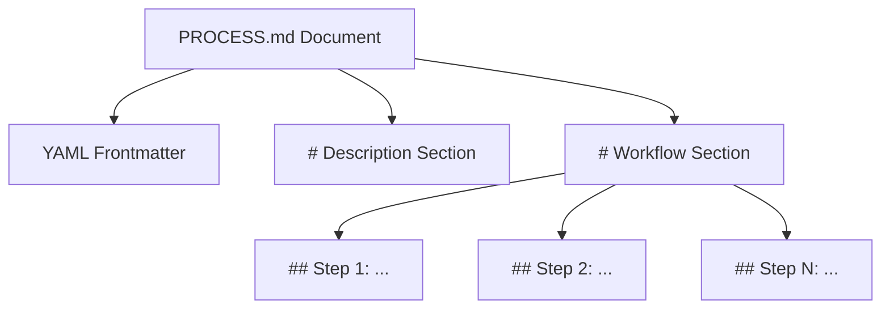

# PROCESS.md Specification v0.1.0

## Status of this Document

This document defines the **v0.1.0** release of the `PROCESS.md` standard. The standard is an open specification for defining executable Standard Operating Procedures (SOPs) for artificial intelligence agents and workflow engines.

---

## 1. Introduction & Design Philosophy

As AI agents move from simple chatbots to operational teammates, organizations need a way to orchestrate multi-step business logic without locking the workflow inside opaque prompt templates, hardcoded code, or brittle visual state machines.

`PROCESS.md` is a prose-first Markdown format that lets operational owners define workflows that humans can read and runtimes can execute step by step. It bridges the gap between human-readable documentation and machine-directed execution.

### 1.1 Core Tenets

* **Prose-First Ownership:** Process owners write and maintain procedures in standard Markdown. The workflow remains readable, auditable, and version-controlled.
* **Separation of Concerns:**
  * **Skills (`SKILL.md`):** Reusable, context-independent capabilities. They define *how* to perform a specific action.
  * **Processes (`PROCESS.md`):** Context-dependent, step-by-step orchestrations. They define *what* to do and *when*.
* **Bounded Reasoning & Isolation:** Runtimes execute workflows one step at a time. The agent should not jump steps, perform later side effects early, or act outside the current step's allowed context.
* **Runtime-Enforced Safety:** Natural language is not a security boundary. Authorization, approvals, side-effect controls, and tool permissions are runtime responsibilities, not guarantees provided by the `PROCESS.md` file itself.

---

## 2. Document Layout

Every conforming `PROCESS.md` document must consist of three blocks in this order:



### 2.1 YAML Frontmatter

The file must begin with YAML frontmatter enclosed by triple dashes (`---`).

#### Required Fields

* **`id`** *(string)*: Unique, stable, lowercase `snake_case` identifier for the process. Must match regex `^[a-z0-9_]+$`.
* **`name`** *(string)*: Human-readable process title.
* **`version`** *(string)*: Semantic version of the process (e.g., `1.0.0`).
* **`owner`** *(string)*: Group, role, or department responsible for maintaining the process.

#### Optional Fields

* **`status`** *(string)*: Lifecycle stage of the process. Allowed values: `draft`, `active`, `deprecated`. Default is `draft`.
* **`description`** *(string)*: One-sentence summary used for cataloging.
* **`tags`** *(list of strings)*: Categories or labels for organization.

#### Example Frontmatter

```yaml
---
id: growth_experiment_review
name: Growth Experiment Review and Analysis
version: 0.1.0
owner: growth-ops
status: active
description: Analyzes completed product growth experiments and prepares a validated summary.
tags: [growth, analytics, operations]
---
```

### 2.2 The `# Description` Section

Immediately following the frontmatter, the document must contain a level-1 heading titled `# Description`.

```markdown
# Description
Detailed operational guidelines, scope boundaries, prerequisites, and business goals.
```

#### Behavioral Rules

1. **Global Context:** A runtime should treat the full `# Description` section as process-level context for every workflow step.
2. **Subsections:** Subheadings such as `## Scope`, `## Expected Outcomes`, and `## Preconditions` are permitted and encouraged.

### 2.3 The `# Workflow` Section

The workflow must contain a level-1 heading titled `# Workflow`. Individual steps are represented by level-2 headings using this syntax:

```markdown
## Step <N>: <Step Name>
```

`<N>` is a sequential integer starting at `1`. `<Step Name>` is a descriptive title.

#### Step Execution Semantics

* **State Isolation:** Runtimes compile or execute each step separately.
* **Text Instructions:** Markdown text beneath each step heading defines the instructions for that step.
* **Reference Invocation:** Steps may reference tools, skills, schemas, or subprocesses. These are core PROCESS.md reference types that implementations must parse and handle.

---

## 3. Reference Syntax

`PROCESS.md` uses inline code references formatted as `` `type/id` `` to bind prose instructions to reusable resources.

The core specification defines the reference syntax and standard reference types. It does not define where referenced resources live, how they are loaded, or what permission model applies.

| Reference Syntax | Intent |
| :--- | :--- |
| `` `skill/<id>` `` | Reusable guidance or capability instructions for the current step. |
| `` `tool/<id>` `` | Executable tool or integration that may be exposed to the current step. |
| `` `schema/<id>` `` | Structured output or payload contract used for validation. |
| `` `process/<id>` `` | Another process invoked as a subprocess. |

### 3.1 Reference Handling

When a runtime parses a step, it should:

1. Identify inline references matching `` `type/id` ``.
2. Validate that `type` is one of `skill`, `tool`, `schema`, or `process`.
3. Resolve `id` using its registry, configuration, package system, or other implementation mechanism.
4. Apply the referenced resource only within the execution context where the reference appears.

Implementations must report unresolved core references as execution errors. They may require explicit permission before loading a resource or support additional reference types as extensions.

---

## 4. Runtime Execution Principles

The runtime is responsible for step-by-step interpretation of `PROCESS.md` documents.

```text
               +-----------------------+
               | Read PROCESS.md       |
               +-----------+-----------+
                           |
                           v
               +-----------------------+
               | Parse & Validate      |
               +-----------+-----------+
                           |
                           v
               +-----------------------+
               | Loop Steps 1..N       |
               +-----------+-----------+
                           |
                           | (Execute Step)
                           v
               +-----------------------+
               | Load Process Context  |
               | + Step Instructions   |
               | + Resolved References |
               +-----------+-----------+
                           |
                           v
               +-----------------------+
               | Run Agent/Engine      |
               +-----------+-----------+
                           |
                           v
               +-----------------------+
               | Validate Output       |
               | (if referenced)       |
               +-----------+-----------+
                           |
                           v
               +-----------------------+
               | Save Step Result      |
               +-----------------------+
```

### 4.1 Step Isolation

At any point in time, the runtime agent should receive:

1. The global `# Description` block.
2. The current step heading and instructions.
3. The references resolved for the current step.
4. The execution history or structured outputs from previous steps, if the runtime carries state forward.

This helps prevent the agent from acting on instructions intended for a different operational stage.

### 4.2 Exception Routing & Branching

Processes may define conditional routing between steps in natural language.

* **Conditional Goto:** e.g., "If the experiment failed validation, go to `## Step 4: Reject Experiment`."
* **Looping:** e.g., "If errors are found, return to `## Step 2: Validate Data` up to a maximum of 3 times."

Runtimes decide whether and how to compile these instructions into routing behavior.

### 4.3 Audit Logs and Evidence Collection

Audit behavior is runtime-defined. A runtime that records execution evidence should capture:

* Time started and completed for each step.
* Prompt inputs and model outputs, if applicable.
* Tool invocations with arguments and results.
* Validation results.
* Human approval requests and decisions, if applicable.

---

## 5. Resource Documents

`PROCESS.md` can reference external resource documents, but this specification does not require a particular directory layout, manifest format, or packaging system.

The core resource types are:

* **Skills:** Markdown guidance files that describe reusable capabilities.
* **Tools:** Programmatic integrations exposed to an agent or workflow engine.
* **Schemas:** Structured contracts used to validate inputs or outputs.
* **Processes:** Other `PROCESS.md` documents invoked as subprocesses.

The lifecycle, loading, authorization, storage, and execution mechanics for those resources are implementation concerns. Specific runtimes may add capabilities, resource types, or policies as extensions, but core PROCESS.md references remain standard.

---

## 6. Compliance and Validation Rules

A conforming `PROCESS.md` parser must validate the document itself before execution:

1. **Syntax Check:**
   * Frontmatter must parse as valid YAML.
   * Level-1 headings must include exactly `# Description` and `# Workflow` in that order.
   * Level-2 headings in the workflow must follow the regex `^## Step \d+: .+$`.
2. **Required Fields:**
   * Frontmatter must include `id`, `name`, `version`, and `owner`.
   * `id` must match `^[a-z0-9_]+$`.
3. **Sequence Check:**
   * Step indices must be sequential and contiguous, starting at `Step 1`.
4. **Reference Syntax Check:**
   * Inline PROCESS.md references must use `` `type/id` `` syntax.
   * Core reference types are `skill`, `tool`, `schema`, and `process`.

Reference existence checks, tool permission checks, schema validation, subprocess cycle detection, approval gates, and audit logging are implementation responsibilities.
